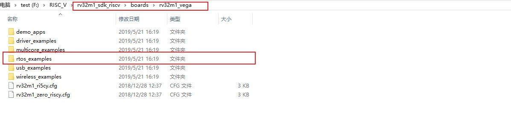

## 跑操作系统
我觉得使用操作系统非但不会加大代码难度，还会极大简化写代码过程，一是系统都会将底层结构事先写好驱动，并开发出各种功能的接口，RISCV复杂的底层构架不用怎么考虑，二是他会集成很多现成的代码库，实现某一项功能仅仅调用相应的代码包，简单配置即可。

`ALIOS `  https://github.com/alibaba/AliOS-Things/wiki说明文档，可以切换成中文的
推荐理由：这个系统是我最开始尝试的，也是最感兴趣的，因为他能更方便的接入阿里系云服务，也就是打开了新世界的大门。可以看看下面的例子，里面阿里的DATAV数据大屏功能很炫，能做出来一套的完整的东西工程量不会太大，还很博人眼球
https://blog.csdn.net/xstardust/article/details/82349359?utm_source=app 
它的开发环境是支持三种操作系统的，我是尝试用Windows系统实现的，不过对织女星板子，Windows下的编译链不完整，这个问题我和开发者聊过，他给出了Linux下的解决方案，Linux下的方案我没尝试，精力有限，想要做的同学可以和我讨论，我对这个系统还是非常感兴趣的[ALIOS_LINUX编译指南](ALIOS_LINUX编译指南.md)。

`RT-thread `https://www.rt-thread.org/document/site/中文说明文档
推荐理由：国产的，编译链完整可用的系统，教程包括文档和视频，因为是中文的看起来还很方便。不过他是以STM32系列作为主要受众的，而且会假定你有了一定的开发经验，里面很多坑还是不好走出来的。这个系统对板子的编译链虽然完整，但底层驱动却支持甚少。目前仅支持串口、GPIO和SD卡，可创造的空间很小。系统使用scons命令生成2进制文件，然后可以参考[织女星开发板嵌入式开发环境搭建.pdf](https://github.com/open-isa-cn/vega-lite/blob/master/%E7%BB%87%E5%A5%B3%E6%98%9F%E5%BC%80%E5%8F%91%E6%9D%BF%E5%B5%8C%E5%85%A5%E5%BC%8F%E5%BC%80%E5%8F%91%E7%8E%AF%E5%A2%83%E6%90%AD%E5%BB%BA.pdf)）将文件烧录进开发板。

`RT-thread+虚拟机`：使用QEMU工具，这个吕老师之前发过，用它来实现功能是软件模拟出来的，不必也不能使用织女星板子，好处是软件模拟不必考虑硬件连接问题及驱动问题，串口问题(可以参考RT-thread里面的视频，有虚拟机的说明)，想实现的功能，只要是系统留有接口的，应该都能实现不过到时候你只能用一个虚拟出来的东西交差了。

`freeos`:原生，深度移植，支持的底层硬件最全，老师之前发的sdk里面就有很多例子，每个例子都有readme里面说了例程的效果和实现方式，
下面是我找的论坛链接，网上应该还有很多riscv32_vega+freeos的博客  
https://www.yiboard.com/thread-1165-1-1.html  

## 裸机开发

`裸机+传感器等外接模块（温湿度、显示屏、舵机等） ` 
如我上图所示的sdk文件位置，里面有各种例程和说明，包括多核通信、蓝牙通信，里面用了iic或spi的协议，协议其实也不用懂，底层的驱动sdk里面也有，大家只要把例子看懂了，看看如何调用接口，就可以稍加改造，进行尝试，或几个功能整合起来;也可以在淘宝买一些其他的模块，大多数的传感器都是iic或spi的协议，可以根据sdk已有的例子加以改造，有些模块直接使用模拟量信号或数字信号驱动，编程就更简单了。

